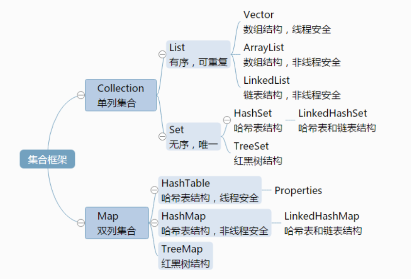
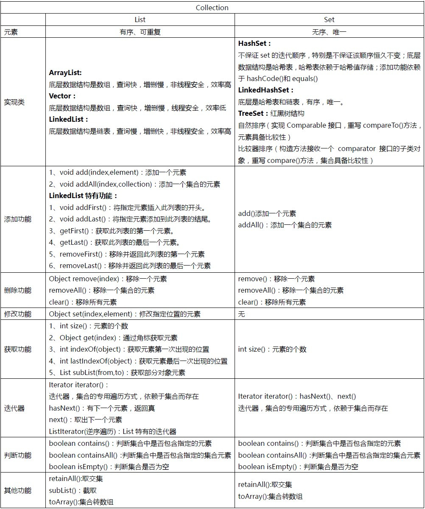
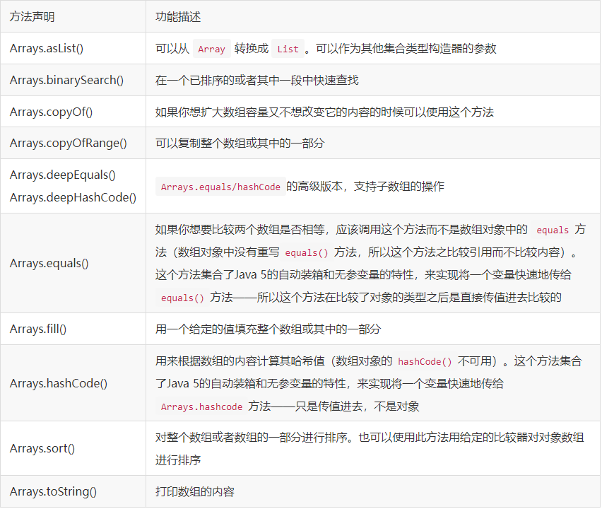

# 学习笔记

## java基础

### 基础语法

基础数据类型：	1.byte	 2.sort	  3.int	 4.long	 5.double	 6.float	 7.char	 8.boolean

String     使用final修饰，不可继承；内部使用final修饰的char数组存储数据，被初始化后不能被改变


循环：

``` java
// 1.for i
for(int i=0 ; i<??;i++) {}

// 2.for each
for (Object obj : list) {}

// 3. while
while(boolean flag) {
    
}

// 4.do while
do {
    
} while(boolean flag)
```

分支：

``` java
if
if else
switch case
? :
```


### 注解反射

#### 反射

1.类加载器（ClassLoader）
.class文件由类加载器加载进内存，然后创建Class类对象
类加载器分类：

> BootStrap：引导类加载器，加载rt.jar中的类
> ExtClassLoader：扩展类加载器，加载lib/ext目录下的类
> AppClassLoader：系统类加载器，加载CLASSPATH下的类，即我们写的类，以及第三方提供的类

类加载器也是Java类，因为其它java类的类加载器本身也要被类加载器加载，显然必须有第一个类加载器不是java类，这正是BootStrap

``` java
ClassLoader
方法	说明
getParent()	获取上级类加载器
loadClass()	实现了类加载的加载流程，也就是算法框架
findLoadedClass()	查看该类是否被加载过
findClass()	真正去加载类，自定义类加载器需要重写的方法
defineClass()	把Class的字节数组byte[]转成Class
```

获取Class对象
1.对象.getClass
2.Class.forName(包名.类名)
3.类名.class

Class 字节码
Class 类的实例表示正在运行的 Java 应用程序中的类和接口

``` java 
forName()	通过类名获取类的字节码
getClassLoader()	获取该类的类加载器
getInterfaces()	获取所实现的接口
getSuperclass()	获取父类
getGenericSuperclass()	获取传递给父类参数化类型
newInstance()	创建实例
getName()	获取类名，接口名
getPackage()	获取包名
isPrimitive()	判定指定的 Class 对象是否表示一个基本类型
isArray()	判定此 Class 对象是否表示一个数组类
getResourceAsStream()	查找具有给定名称的资源
```

``` java
获取注解
方法	说明
getAnnotation()	获取指定类型的注解
getAnnotations()	获取所有的注解
getDeclaredAnnotations()	获取除了继承得到的所有注解
获取构造方法
方法	说明
getConstructor()	获取指定的非私有的构造方法
getDeclaredConstructor()	获取指定的构造方法
getConstructors()	获取公有的构造方法
getDeclaredConstructors()	获取所有的构造方法
获取成员方法
方法	说明
getMethod()	获取指定的非私有方法
getDeclaredMethod()	获取指定的方法
getMethods()	获取公有的方法
getDeclaredMethods()	获取所有的方法
获取成员变量
方法	说明
getField()	获取指定名称的字段
getFields()	获取公有的字段
getDeclaredField(String name)	获取指定名称的字段
getDeclaredFields()	获取所有的字段

AccessibleObject
AccessibleObject 类是 Field、Method 和 Constructor 对象的基类

方法	说明
getAnnotation()	获取指定类型的注解
getAnnotations()	获取所有的注解
getDeclaredAnnotations()	获取除了继承得到的所有注解
setAccessible(true)	暴力反射，取消访问检查

Constructor
Constructor 提供关于类的单个构造方法的信息以及对它的访问权限

方法	说明
newInstance()	通过构造方法创建实例
getParameterTypes()	获取构造器的所有参数的类型
getExceptionTypes()	获取构造器上声明的所有异常类型
getDeclaringClass()	获取构造器所属的类型
getModifiers()	获取构造器上的所有修饰符信息

Method
表示一个类中的成员方法

方法	说明
invoke(Object obj, Object… args)	通过方法反射对象调用方法，如果当前方法是实例方法，那么当前对象就是obj，如果当前方法是static方法，那么可以给obj传递null。args表示是方法的参数
setAccessible(true)	暴力反射，取消访问检查
getAnnotation()	获取方法上指定类型的注解
getAnnotations()	获取所有的注解
getDeclaredAnnotations()	获取方法上说所有的注解
getGenericParameterTypes()	获取泛型的参数化类型
getModifiers()	获取方法的权限修饰符，Modifier.PUBLIC，Modifier.ABSTRACT，Modifier.STATIC
getParameterTypes()	获取方法参数

Field
表示一个类中的成员变量

方法	说明
getAnnotation()	获取字段上指定类型的注解
getAnnotations()	获取所有的注解
getDeclaredAnnotations()	获取字段所有的注解
set()	给指定字段设置新值
get()	获取字段值
setAccessible(true)	暴力反射，取消访问检查
getType()	获取字段的类型
getXXX(Object obj)	如果当前属性为基本类型，可以使用getXXX()系列方法获取基本类型属性值
setXXX(Object obj, XXX value)	如果当前属性为基本类型，可以使用setXXX()系统方法基本类型属性值

```

#### 注解

一个自定义注解

``` java
@Target(ElementType.FIELD)
@Retention(RetentionPolicy.RUNTIME)
public @interface ViewInject {
    int value();//当使用注解时，如果只给名为value的属性赋值时，可以省略“value=”
    String name() default "zhangsan";//默认值
}
```

@Target 表示注解的作用目标，是一个枚举值

``` java
@Target(ElementType.TYPE)	用于接口(注解本质上也是接口),类,枚举
@Target(ElementType.FIELD)	用于字段,枚举常量
@Target(ElementType.METHOD)	用于方法
@Target(ElementType.PARAMETER)	用于方法参数
@Target(ElementType.CONSTRUCTOR)	用于构造参数
@Target(ElementType.LOCAL_VARIABLE)	用于局部变量
@Target(ElementType.ANNOTATION_TYPE)	用于注解
@Target(ElementType.PACKAGE)	用于包

```

@Retention
表示注解的保存策略，也是一个枚举值

``` java
RetentionPolicy.SOURCE	注解只保存在源代码中，即.java文件
RetentionPolicy.CLASS	注解保存在字节码中,即.class文件
RetentionPolicy.RUNTIME	注解保存在内存中的字节码，可用于反射
```

@Documented
是否会保存到 Javadoc 文档中

@Inherited
是否可以被继承，默认为 false


### 多线程

进程：进程就是正在运行的程序，是系统进行资源分配和调用的独立单位。
线程：每个运行的程序都是一个进程，在一个进程中还可以有多个执行单元同时运行，这些执行单元可以看作程序执行的一条条线索，被称为线程。
多线程意义：其实是为了提高应用程序的使用率。程序的执行其实都是在抢CPU的资源，CPU的执行权。
进程与线程的区别

``` text
调度：线程作为CUP调度和分配的基本单位，进程作为拥有资源的基本单位。
并发性：不仅进程之间可以并发执行，同一个进程的多个线程之间也可并发执行。
拥有资源：进程是拥有资源的一个独立单位，线程不拥有系统资源，但可以访问隶属于进程的资源。
系统开销：在创建或撤消进程时，由于系统都要为之分配和回收资源，导致系统的开销明显大于创建或撤消线程时的开销。在进程切换时，耗费资源较大，效率要差一些。
健壮性：进程有独立的地址空间，一个进程崩溃后，在保护模式下不会对其它进程产生影响，而线程只是一个进程中的不同执行路径。线程有自己的堆栈和局部变量，但线程之间没有单独的地址空间，一个进程死掉就等于所有的线程死掉，所以多进程的程序要比多线程的程序健壮。进程间的crash不会相互影响，但是一个线程的crash会使整个进程都crash，其他线程也跟着都挂了
```

#### 多线程实现

1：继承Thread类，重写run()方法

``` java
// 线程启动：
// Thread.start()启动线程
public final String getName()// 获取线程的名称
public final void setName(String name)// 设置线程的名称
Thread(String name)// 通过构造方法给线程起名字
```

2：实现Runnable接口，覆写run()方法

``` java
// 线程启动方法
// 创建Runnable实现类对象，把对象传给Thread的构造方法，调用start()启动线程
class Thread1 implements Runnable {
    // 
}
main(String[] args) {
    Thread t = new Thread(Thread1.class);
    t.start();
}
```

3：实现Callable接口,重写call()方法

``` java
// 线程启动方法
// 创建线程池对象
// public static ExecutorService newFixedThreadPool(int nThreads)
ExecutorService pool = Executors.newFixedThreadPool(2);
// Future<?> submit(Runnable task) || <T> Future<T> submit(Callable<T> task)
pool.submit(target);
// 线程结束
pool.shutdown();
```

4:匿名内部类或labmda表达式

``` java
// 内部类
new Thread() {

}.start();
new Thread(()->{}).start();
```

### 集合框架

#### collection


集合只用于存储对象，集合长度是可变的，集合可以存储不同类型的对象。
Collection方法：

``` java
add() //添加元素
addAll() //添加一个集合的元素

remove()	//删除元素
removeAll()	//删除一个集合的元素
clear()	//清空集合

contains()	// 判断集合是否包含指定的元素
containsAll()	// 判断一个集合是否包含一个集合的元素
isEmpty()	// 判断集合是否为空

size()	// 获取集合的长度
retainAll()	// 取两个集合的交集

toArray()	// 把集合转成数组，可以实现集合的遍历
iterator()	// 迭代器，集合的专用遍历方式
```


Collections工具类

``` java
public static <T> void sort(List<T> list)
public static <T> int binarySearch(List<?> list,T key)
public static <T> T max(Collection<?> coll)
public static void reverse(List<?> list) // 反转指定列表中元素的顺序。
public static void shuffle(List<?> list) // 打乱在一个 List 中可能有的任何排列的踪迹。
fill(List<? super T> list, T obj) // 使用指定元素替换指定列表中的所有元素。
// 将所有元素从一个列表复制到另一个列表。
// 用两个参数，一个目标 List 和一个源 List, 将源的元素拷贝到目标，并覆盖它的内容。
// 目标 List 至少与源一样长。如果它更长，则在目标 List 中的剩余元素不受影响。
copy(List<? super T> dest, List<? extends T> src)
List<T> synchronizedList(List<T> list);//返回支持的同步（线程安全的）List集合

Map<K,V> synchronizedMap(Map<K,V> m)//返回支持的同步（线程安全的）Map集合
```

Arrays工具类


#### Map

**Map接口和Collection接口的不同**

```
Map是双列的,Collection是单列的
Map的键唯一,Collection的子体系Set是唯一的
Map集合的数据结构值针对键有效，跟值无关
Collection集合的数据结构是针对元素有效
```

**Map常用的子类：**

```
Hashtable：内部结构是哈希表，是同步的。不允许null作为键，null作为值。
Properties：用来存储键值对型的配置文件的信息，可以和IO技术相结合。
HashMap：内部结构式哈希表，不是同步的。允许null作为键，null作为值。
TreeMap：内部结构式二叉树，不是同步的。可以对Map结合中的键进行排序。
HashSet实现Set接口，由哈希表（实际上是一个HashMap实例）支持。
```

**Map接口常用方法**

```
方法声明	功能描述
put(K key, V value)	有添加和替换功能
putAll(Map m)	添加一个Map的元素
clear()	清空集合
remove(Object key)	根据键删除一个元素
containsKey()	判断集合是否包含指定的键
containsValue()	判断集合是否包含指定的值
isEmpty()	判断集合是否为空
get(Object key)	根据键获取值
keySet()	获取所有的键
values()	获取所有的值
entrySet()	获取所有的Entry
size()	获取集合元素的个数
```

**Stream 操作集合**
流式 API，获取Stream：Collection的stream()方法

```
Stream
IntStream
LongStream
DoubleStream
```

对应的Builder

```
Stream.Builder
IntStream.Builder
LongStream.Builder
DoubleStream.Builder
```

中间方法

```
方法声明	功能描述
filter()	过滤
map()	转换
mapToXxx()	一对一转换
flatMap()	集合扁平化
flatMapToXxx()	
peek()	
skip()	
distinct()	去重
sorted()	排序
limit()	
concat()	合并流
```

末端方法

```
方法声明	功能描述
forEach()	遍历
toArray()	将流中的元素转换成数组
reduce()	合并流中的元素
min()	最小值
max()	最大值
count()	获取流中元素的数量
anyMatch()	
allMatch()	
nonMatch()	
findFirst()	获取流中的第一个元素
findAny()	获取流中的任意一个元素
```

### I/O 流


#### File类

构造方法

```java
方法	功能描述
File(String pathname)	根据路径得到File对象
File(String parent,String child)	根据目录和子文件/目录得到对象
File(File parent,String child)	根据父File对象和子文件/目录得到对象
```

创建功能

```java
返回值	方法	功能描述
boolean	createNewFile()	创建文件
File	createTempFile()	创建一个用于缓存的临时文件
boolean	mkdir()	创建文件夹
boolean	mkdirs()	创建多级文件夹，如果父级文件夹不存在，会自动创建

renamneTo(File dest)	路径名相同就是重命名，不一样就是改名加剪切
```

判断功能

``` java
方法	功能描述
isDirectory()	判断是否是目录
isFile()	判断是否是文件
exists()	判断是否是存在
canRead()	判断是否是可读
canWrite()	判断是否是可写
isHidden()	判断是否是隐藏
isAbsolute()	是否是绝对路径
```

获取功能

``` java
返回值	方法	功能描述
String	getAbsolutePath()	获取绝对路径
String	getPath()	获取相对路径
String	getParent()	获取父目录
String	getName()	获取名称
long	getFreeSpace()	获取剩余可用空间
long	getTotalSpace()	获取总大小
long	length()	获取长度，字节数
long	lastModified()	获取最后一次修改时间，毫秒值
String[]	list()	获取指定目录下的所有文件或文件夹的名称数组
File[]	listFiles()	获取指定目录下的所有文件或文件夹的File数组
```

高级获取功能

``` java
返回值	方法	功能描述
String[]	list(FilenameFilter filter)	返回满足条件的文件名数组
File[]	listFiles(FilenameFilter filter)	返回满足条件的文件数组
File[]	listRoots()	列出系统所有的根路径
```

#### 字节IO流

字节流写数据的方式

``` java
方法	说明
write(int b)	一次写一个字节
write(byte[] b)	一次写一个字节数组
write(byte[] b,int off,int len)	一次写一个字节数组的一部分
flush()	刷新缓冲区
close()	释放资源
```

字节流读数据的方式

``` java
方法	功能描述
int read()	一次读取一个字节
int read(byte[] b)	一次读取一个字节数组
int read(byte[] b,int off,int len)	一次读一个字节数组的一部分
void close()	释放资源
```

#### 字符IO流

``` java
方法	功能描述
write(int c)	写入一个字符
write(char[] cbuf)	写入一个字符数组
write(char[] cbuf,int off,int len)	写入一个字符数组的一部分
write(String str)	写入一个字符串
write(String str,int off,int len)	写入一个字符串的一部分


```

### socket

java 发送邮件

```xml
<!-- https://mvnrepository.com/artifact/javax.mail/mail -->
<dependency>
    <groupId>javax.mail</groupId>
    <artifactId>mail</artifactId>
    <version>1.4.7</version>
</dependency>

<!-- https://mvnrepository.com/artifact/javax.activation/activation -->
<dependency>
    <groupId>javax.activation</groupId>
    <artifactId>activation</artifactId>
    <version>1.1.1</version>
</dependency>
```


## mysql

### 安装

配置文件

``` ini
[client]
port=3307
default-character-set=utf8
[mysqld] 
# 设置为自己MYSQL的安装目录 
basedir=D:\app\mysql\mysql-5.7.37-winx64
# 设置为MYSQL的数据目录 
datadir=D:\app\mysql\mysql-5.7.37-winx64\data
port=3307
character_set_server=utf8
sql_mode=NO_ENGINE_SUBSTITUTION,NO_AUTO_CREATE_USER
#开启查询缓存
explicit_defaults_for_timestamp=true
# skip-grant-tables   
```

`mysqld --initialize -insecure`
`mysqld -install mysql[版本号]`
`net start mysql[版本号]`
`mysql -u root -p`
`alter user "root"@"localhost" identified by "密码";`

#### mysql连接

##### 8

​	url: jdbc:mysql://localhost:3306/bs-mall?useUnicode=true&characterEncoding=utf8&useSSL=false&serverTimezone=GMT%2B8

​	driver: com.mysql.cj.jdbc.Driver

##### 5.7

​	url: jdbc:mysql://localhost:3306/bs-mall?useUnicode=true&characterEncoding=utf8&useSSL=false

​	driver: com.mysql.jdbc.Driver


## mybatis

maven依赖

``` xml
<!-- https://mvnrepository.com/artifact/org.mybatis/mybatis -->
<dependency>
    <groupId>org.mybatis</groupId>
    <artifactId>mybatis</artifactId>
    <version>3.5.7</version>
</dependency>
```

整合spring

``` xml
<!-- https://mvnrepository.com/artifact/org.mybatis/mybatis-spring -->
<dependency>
    <groupId>org.mybatis</groupId>
    <artifactId>mybatis-spring</artifactId>
    <version>2.0.6</version>
</dependency>
```

整合springboot

``` xml
<!-- https://mvnrepository.com/artifact/org.mybatis.spring.boot/mybatis-spring-boot-starter -->
<dependency>
    <groupId>org.mybatis.spring.boot</groupId>
    <artifactId>mybatis-spring-boot-starter</artifactId>
    <version>2.1.4</version>
</dependency>
```

plus

``` xml
<!-- https://mvnrepository.com/artifact/com.baomidou/mybatis-plus-boot-starter -->
<dependency>
    <groupId>com.baomidou</groupId>
    <artifactId>mybatis-plus-boot-starter</artifactId>
    <version>3.5.1</version>
</dependency>
```

### 代码生成器

maven插件

``` xml
<plugin>
    <groupId>org.mybatis.generator</groupId>
    <artifactId>mybatis-generator-maven-plugin</artifactId>
    <version>1.3.5</version>
    <configuration>
        <!-- 代码生成器插件配置文件位置指定 -->
        <configurationFile>${basedir}/src/main/resources/generator/generatorConfig.xml</configurationFile>
        <overwrite>true</overwrite>
        <verbose>true</verbose>
    </configuration>
</plugin>
```

generatorConfig.xml内容

``` xml
<?xml version="1.0" encoding="UTF-8"?>
<!DOCTYPE generatorConfiguration
        PUBLIC "-//mybatis.org//DTD MyBatis Generator Configuration 1.0//EN"
        "http://mybatis.org/dtd/mybatis-generator-config_1_0.dtd">

<generatorConfiguration>
    <!-- 数据库驱动:选择你的本地硬盘上面的数据库驱动包-->
    <classPathEntry  location="D:\app\maven\maven-3.8.4\repo\mysql\mysql-connector-java\8.0.28\mysql-connector-java-8.0.28.jar"/>
    <context id="DB2Tables"  targetRuntime="MyBatis3">
        <commentGenerator>
            <property name="suppressDate" value="true"/>
            <!-- 是否去除自动生成的注释 true：是 ： false:否 -->
            <property name="suppressAllComments" value="true"/>
        </commentGenerator>
        <!--数据库链接URL，用户名、密码 -->
        <jdbcConnection driverClass="com.mysql.cj.jdbc.Driver" connectionURL="jdbc:mysql://localhost:3306/mall?useSSL=false&amp;serverTimezone=UTC" userId="root" password="000000">
        </jdbcConnection>
        <javaTypeResolver>
            <property name="forceBigDecimals" value="false"/>
        </javaTypeResolver>
        <!-- 生成模型的包名和位置-->
        <javaModelGenerator targetPackage="com.zfx.mall.model" targetProject="src/main/java">
        </javaModelGenerator>
        <!-- 生成映射文件的包名和位置-->
        <sqlMapGenerator targetPackage="mapping/generated" targetProject="src/main/resources">
        </sqlMapGenerator>
        <!-- 生成DAO的包名和位置-->
        <javaClientGenerator type="XMLMAPPER" targetPackage="com.zfx.mall.dao" targetProject="src/main/java">
        </javaClientGenerator>
        <!-- 要生成的表 tableName是数据库中的表名或视图名 domainObjectName是实体类名-->
        <table tableName="user" domainObjectName="User" mapperName="UserDAO" catalog="mall">
            <property name="ignoreQualifiersAtRuntime" value="true"/>
            <generatedKey column="id" sqlStatement="MySql" identity="true"/>
        </table>
    </context>
</generatorConfiguration>

```

mybatis的xml文件约束

``` xml
<?xml version="1.0" encoding="UTF-8"?>
<!DOCTYPE mapper PUBLIC "-//mybatis.org//DTD Mapper 3.0//EN" "http://mybatis.org/dtd/mybatis-3-mapper.dtd">
<mapper namespace="com.zfx.mall.dao.UserSpecDAO">

</mapper>
```

执行maven插件自动生成代码

### mybatis plus

1.相关依赖

``` xml
    <!-- https://mvnrepository.com/artifact/com.baomidou/mybatis-plus-boot-starter -->
    <dependency>
        <groupId>com.baomidou</groupId>
        <artifactId>mybatis-plus-boot-starter</artifactId>
        <version>3.5.1</version>
    </dependency>

	<!-- 代码生成器依赖 -->
    <dependency>
        <groupId>com.baomidou</groupId>
        <artifactId>mybatis-plus-generator</artifactId>
        <version>3.5.1</version>
    </dependency>
    <dependency>
        <groupId>org.apache.velocity</groupId>
        <artifactId>velocity-engine-core</artifactId>
        <version>2.3</version>
    </dependency>
    <!--freemarker模板-->
    <dependency>
        <groupId>org.freemarker</groupId>
        <artifactId>freemarker</artifactId>
    </dependency>
```

2.代码生成器

``` java
public static void main(String[] args) {
        FastAutoGenerator.create("jdbc:mysql://localhost:3306/bs-mall?useUnicode=true&characterEncoding=utf8&useSSL=false&serverTimezone=GMT%2B8",
                        "root", "000000")
                .globalConfig(builder -> {
                    builder.author("zfx") // 设置作者
                            .fileOverride() // 覆盖已生成文件
                        	// 指定输出目录
                            .outputDir(System.getProperty("user,dir") + "\\bs-mall\\src\\main\\java"); 
                })
                .packageConfig(builder -> {
                    builder.parent("com") // 设置父包名
                            .moduleName("zfx") // 设置父包模块名
                            .entity("model")
                            .mapper("mapper")
                            .xml("mapping")
                            .service("service")
                            // 设置mapperXml生成路径
                            .pathInfo(Collections.singletonMap(OutputFile.mapperXml,
                                    System.getProperty("user,dir") + "\\bs-mall\\src\\main\\resources\\mapping")); 
                })
                .strategyConfig(builder -> {
                    builder.addInclude("user") // 设置需要生成的表名
                            .serviceBuilder()
                            .formatServiceFileName("%sService")
                            .mapperBuilder()
                            .enableMapperAnnotation()
                            .superClass(BaseMapper.class)
                            .formatMapperFileName("%sMapper")
                            .formatXmlFileName("%sMapper");
                })
                .templateEngine(new FreemarkerTemplateEngine())
                .execute();
    }
```


## hibernate


### 1.HQL

- 关键子不区分大小写，表名，属性名区分

1. form

```java
// User 可以指定全路径名
String hql = " form User";
Query query = session.createQuery(hql);
List result = query.list();
```

2. as

```java
String hql = " form User as u";
Query query = session.createQuery(hql);
List result = query.list();
```

3. select

```java
String hql = "SELECT U.name FROM User U";
Query query = session.createQuery(hql);
List results = query.list();
```

4. where

```java
String hql = "FROM User U WHERE U.id = 10";
Query query = session.createQuery(hql);
List results = query.list();
```

5. order by

```java
String hql = "FROM User U WHERE U.id > 10 " +
             "ORDER BY U.name DESC, U.salary DESC ";
Query query = session.createQuery(hql);
List results = query.list();
```

6. group by

```java
String hql = "SELECT SUM(u.salary), u.name FROM User u " +
             "GROUP BY u.name";
Query query = session.createQuery(hql);
List results = query.list();
```

7. 设置参数

```java
String hql = "FROM User u WHERE u.id = :uid";
Query query = session.createQuery(hql);
query.setParameter("uid",10);
List results = query.list();
```

8. update

```java
String hql = "UPDATE User set salary = :salary "  + 
             "WHERE id = :uid";
Query query = session.createQuery(hql);
query.setParameter("salary", 1000);
query.setParameter("uid", 10);
int result = query.executeUpdate();
System.out.println("Rows affected: " + result);
```

9. delete

```java
String hql = "DELETE FROM User "  + 
             "WHERE id = :uid";
Query query = session.createQuery(hql);
query.setParameter("uid", 10);
int result = query.executeUpdate();
System.out.println("Rows affected: " + result);
```

10. insert

```java
String hql = "INSERT INTO User(firstName, lastName, salary)"  + 
             "SELECT firstName, lastName, salary FROM old_user";
Query query = session.createQuery(hql);
int result = query.executeUpdate();
System.out.println("Rows affected: " + result);
```

11. 聚合函数

```java
// avg(property name)
// count(property name or *)
// max(property name)
// min(property name)
// sum(property name)

```

12. 去重

```java
// distinct
String hql = "SELECT count(distinct u.name) FROM User u";
Query query = session.createQuery(hql);
List results = query.list();
```

13. 分页

```java
// 该方法以一个整数表示结果中的第一行,从 0 行开始。
// 从哪儿开始
Query setFirstResult(int startPosition)
    
// 这个方法告诉 Hibernate 来检索固定数量，即 maxResults 个对象。
// 到哪儿结束
Query setMaxResults(int maxResult)

// 例
String hql = "FROM User";
Query query = session.createQuery(hql);
query.setFirstResult(1);
query.setMaxResults(10);
List results = query.list();
```

### 2、标准查询


## spring boot 

### 工具类

#####  Assert 

```java
// 要求参数 object 必须为非空（Not Null），否则抛出异常，不予放行
// 参数 message 参数用于定制异常信息。
void notNull(Object object, String message)
// 要求参数必须空（Null），否则抛出异常，不予『放行』。
// 和 notNull() 方法断言规则相反
void isNull(Object object, String message)
// 要求参数必须为真（True），否则抛出异常，不予『放行』。
void isTrue(boolean expression, String message)
// 要求参数（List/Set）必须非空（Not Empty），否则抛出异常，不予放行
void notEmpty(Collection collection, String message)
// 要求参数（String）必须有长度（即，Not Empty），否则抛出异常，不予放行
void hasLength(String text, String message)
// 要求参数（String）必须有内容（即，Not Blank），否则抛出异常，不予放行
void hasText(String text, String message)
// 要求参数是指定类型的实例，否则抛出异常，不予放行
void isInstanceOf(Class type, Object obj, String message)
// 要求参数 `subType` 必须是参数 superType 的子类或实现类，否则抛出异常，不予放行
void isAssignable(Class superType, Class subType, String message)
```

#####  ObjectUtils

**获取对象的基本信息**

```java
// 获取对象的类名。参数为 null 时，返回字符串："null" 
String nullSafeClassName(Object obj)
// 参数为 null 时，返回 0
int nullSafeHashCode(Object object)
// 参数为 null 时，返回字符串："null"
String nullSafeToString(boolean[] array)
// 获取对象 HashCode（十六进制形式字符串）。参数为 null 时，返回 0 
String getIdentityHexString(Object obj)
// 获取对象的类名和 HashCode。 参数为 null 时，返回字符串："" 
String identityToString(Object obj)
// 相当于 toString()方法，但参数为 null 时，返回字符串：""
String getDisplayString(Object obj)
```

**判断工具**

```java
// 判断数组是否为空
boolean isEmpty(Object[] array)
// 判断参数对象是否是数组
boolean isArray(Object obj)
// 判断数组中是否包含指定元素
boolean containsElement(Object[] array, Object element)
// 相等，或同为 null时，返回 true
boolean nullSafeEquals(Object o1, Object o2)
/*
判断参数对象是否为空，判断标准为：
    Optional: Optional.empty()
       Array: length == 0
CharSequence: length == 0
  Collection: Collection.isEmpty()
         Map: Map.isEmpty()
 */
boolean isEmpty(Object obj)
```

**其他工具方法**

```java
// 向参数数组的末尾追加新元素，并返回一个新数组
<A, O extends A> A[] addObjectToArray(A[] array, O obj)
// 原生基础类型数组 --> 包装类数组
Object[] toObjectArray(Object source)
```

##### StringUtils

**字符串判断工具**

```java
// 判断字符串是否为 null，或 ""。注意，包含空白符的字符串为非空
boolean isEmpty(Object str)
// 判断字符串是否是以指定内容结束。忽略大小写
boolean endsWithIgnoreCase(String str, String suffix)
// 判断字符串是否已指定内容开头。忽略大小写
boolean startsWithIgnoreCase(String str, String prefix) 
// 是否包含空白符
boolean containsWhitespace(String str)
// 判断字符串非空且长度不为 0，即，Not Empty
boolean hasLength(CharSequence str)
// 判断字符串是否包含实际内容，即非仅包含空白符，也就是 Not Blank
boolean hasText(CharSequence str)
// 判断字符串指定索引处是否包含一个子串。
boolean substringMatch(CharSequence str, int index, CharSequence substring)
// 计算一个字符串中指定子串的出现次数
int countOccurrencesOf(String str, String sub)
```

**字符串操作工具**

```java
// 查找并替换指定子串
String replace(String inString, String oldPattern, String newPattern)
// 去除尾部的特定字符
String trimTrailingCharacter(String str, char trailingCharacter) 
// 去除头部的特定字符
String trimLeadingCharacter(String str, char leadingCharacter)
// 去除头部的空白符
String trimLeadingWhitespace(String str)
// 去除头部的空白符
String trimTrailingWhitespace(String str)
// 去除头部和尾部的空白符
String trimWhitespace(String str)
// 删除开头、结尾和中间的空白符
String trimAllWhitespace(String str)
// 删除指定子串
String delete(String inString, String pattern)
// 删除指定字符（可以是多个）
String deleteAny(String inString, String charsToDelete)
// 对数组的每一项执行 trim() 方法
String[] trimArrayElements(String[] array)
// 将 URL 字符串进行解码
String uriDecode(String source, Charset charset)
```

**路径相关工具方法**

```java
// 解析路径字符串，优化其中的 “..” 
String cleanPath(String path)
// 解析路径字符串，解析出文件名部分
String getFilename(String path)
// 解析路径字符串，解析出文件后缀名
String getFilenameExtension(String path)
// 比较两个两个字符串，判断是否是同一个路径。会自动处理路径中的 “..” 
boolean pathEquals(String path1, String path2)
// 删除文件路径名中的后缀部分
String stripFilenameExtension(String path) 
// 以 “. 作为分隔符，获取其最后一部分
String unqualify(String qualifiedName)
// 以指定字符作为分隔符，获取其最后一部分
String unqualify(String qualifiedName, char separator)
```

##### CollectionUtils

**集合判断工具**

```java
// 判断 List/Set 是否为空
boolean isEmpty(Collection<?> collection)
// 判断 Map 是否为空
boolean isEmpty(Map<?,?> map)
// 判断 List/Set 中是否包含某个对象
boolean containsInstance(Collection<?> collection, Object element)
// 以迭代器的方式，判断 List/Set 中是否包含某个对象
boolean contains(Iterator<?> iterator, Object element)
// 判断 List/Set 是否包含某些对象中的任意一个
boolean containsAny(Collection<?> source, Collection<?> candidates)
// 判断 List/Set 中的每个元素是否唯一。即 List/Set 中不存在重复元素
boolean hasUniqueObject(Collection<?> collection)
```

**集合操作工具**

```java
// 将 Array 中的元素都添加到 List/Set 中
<E> void mergeArrayIntoCollection(Object array, Collection<E> collection)  
// 将 Properties 中的键值对都添加到 Map 中
<K,V> void mergePropertiesIntoMap(Properties props, Map<K,V> map)
// 返回 List 中最后一个元素
<T> T lastElement(List<T> list)  
// 返回 Set 中最后一个元素
<T> T lastElement(Set<T> set) 
// 返回参数 candidates 中第一个存在于参数 source 中的元素
<E> E findFirstMatch(Collection<?> source, Collection<E> candidates)
// 返回 List/Set 中指定类型的元素。
<T> T findValueOfType(Collection<?> collection, Class<T> type)
// 返回 List/Set 中指定类型的元素。如果第一种类型未找到，则查找第二种类型，以此类推
Object findValueOfType(Collection<?> collection, Class<?>[] types)
// 返回 List/Set 中元素的类型
Class<?> findCommonElementType(Collection<?> collection)
```

##### FileCopyUtils

**输入**

```java
// 从文件中读入到字节数组中
byte[] copyToByteArray(File in)
// 从输入流中读入到字节数组中
byte[] copyToByteArray(InputStream in)
// 从输入流中读入到字符串中
String copyToString(Reader in)
```

**输出**

```java
// 从字节数组到文件
void copy(byte[] in, File out)
// 从文件到文件
int copy(File in, File out)
// 从字节数组到输出流
void copy(byte[] in, OutputStream out) 
// 从输入流到输出流
int copy(InputStream in, OutputStream out) 
// 从输入流到输出流
int copy(Reader in, Writer out)
// 从字符串到输出流
void copy(String in, Writer out)
```

##### **ResourceUtils**

**从资源路径获取文件**

```java
// 判断字符串是否是一个合法的 URL 字符串。
static boolean isUrl(String resourceLocation)
// 获取 URL
static URL getURL(String resourceLocation) 
// 获取文件（在 JAR 包内无法正常使用，需要是一个独立的文件）
static File    getFile(String resourceLocation)
```

**Resource**

```java
// 文件系统资源 D:\...
FileSystemResource
// URL 资源，如 file://... http://...
UrlResource
// 类路径下的资源，classpth:...
ClassPathResource
// Web 容器上下文中的资源（jar 包、war 包）
ServletContextResource

// 判断资源是否存在
boolean exists()
// 从资源中获得 File 对象
File getFile()
// 从资源中获得 URI 对象
URI getURI()
// 从资源中获得 URI 对象
URL getURL()
// 获得资源的 InputStream
InputStream getInputStream()
// 获得资源的描述信息
String getDescription()
```

##### **StreamUtils** 

**输入**

```java
void copy(byte[] in, OutputStream out)
int copy(InputStream in, OutputStream out)
void copy(String in, Charset charset, OutputStream out)
long copyRange(InputStream in, OutputStream out, long start, long end)
```

**输出**

```java
byte[] copyToByteArray(InputStream in)
String copyToString(InputStream in, Charset charset)
// 舍弃输入流中的内容
int drain(InputStream in) 
```

##### **ReflectionUtils**

**获取方法**

```java
// 在类中查找指定方法
Method findMethod(Class<?> clazz, String name) 
// 同上，额外提供方法参数类型作查找条件
Method findMethod(Class<?> clazz, String name, Class<?>... paramTypes) 
// 获得类中所有方法，包括继承而来的
Method[] getAllDeclaredMethods(Class<?> leafClass) 
// 在类中查找指定构造方法
Constructor<T> accessibleConstructor(Class<T> clazz, Class<?>... parameterTypes) 
// 是否是 equals() 方法
boolean isEqualsMethod(Method method) 
// 是否是 hashCode() 方法 
boolean isHashCodeMethod(Method method) 
// 是否是 toString() 方法
boolean isToStringMethod(Method method) 
// 是否是从 Object 类继承而来的方法
boolean isObjectMethod(Method method) 
// 检查一个方法是否声明抛出指定异常
boolean declaresException(Method method, Class<?> exceptionType) 
```

**执行方法**

```java
// 执行方法
Object invokeMethod(Method method, Object target)  
// 同上，提供方法参数
Object invokeMethod(Method method, Object target, Object... args) 
// 取消 Java 权限检查。以便后续执行该私有方法
void makeAccessible(Method method) 
// 取消 Java 权限检查。以便后续执行私有构造方法
void makeAccessible(Constructor<?> ctor) 
```

**获取字段**

```java
// 在类中查找指定属性
Field findField(Class<?> clazz, String name) 
// 同上，多提供了属性的类型
Field findField(Class<?> clazz, String name, Class<?> type) 
// 是否为一个 "public static final" 属性
boolean isPublicStaticFinal(Field field) 
```

**设置字段**

```java
// 获取 target 对象的 field 属性值
Object getField(Field field, Object target) 
// 设置 target 对象的 field 属性值，值为 value
void setField(Field field, Object target, Object value) 
// 同类对象属性对等赋值
void shallowCopyFieldState(Object src, Object dest)
// 取消 Java 的权限控制检查。以便后续读写该私有属性
void makeAccessible(Field field) 
// 对类的每个属性执行 callback
void doWithFields(Class<?> clazz, ReflectionUtils.FieldCallback fc) 
// 同上，多了个属性过滤功能。
void doWithFields(Class<?> clazz, ReflectionUtils.FieldCallback fc, 
                  ReflectionUtils.FieldFilter ff) 
// 同上，但不包括继承而来的属性
void doWithLocalFields(Class<?> clazz, ReflectionUtils.FieldCallback fc) 
```

##### **AopUtils**

**判断代理类型**

```java
// 判断是不是 Spring 代理对象
boolean isAopProxy()
// 判断是不是 jdk 动态代理对象
isJdkDynamicProxy()
// 判断是不是 CGLIB 代理对象
boolean isCglibProxy()
```

**获取被代理对象的 class**

```java
// 获取被代理的目标 class
Class<?> getTargetClass()
```

**AopContext**

**获取当前对象的代理对象**

```java
Object currentProxy()
```

## HTTP

### 1.什么是http

> 超文本传输协议（英语：HyperText Transfer Protocol，缩写：HTTP）
>
> HTTP是一个基于TCP/IP通信协议来传递数据（HTML 文件, 图片文件, 查询结果等）。

## window控制台命令

``` cmd
netstat -aon | findstr "port" -- 查看端口使用情况
tasklist | findstr "进程号/程序名" -- 查看指定进程号的应用名
taskkill /f /t /im 应用程序名 -- 关闭指定的应用程序，释放端口
```

## 加密工具

``` java
package com.z.common.util;


import javax.crypto.Cipher;
import javax.crypto.KeyGenerator;
import javax.crypto.Mac;
import javax.crypto.SecretKey;
import javax.crypto.spec.SecretKeySpec;
import java.security.MessageDigest;
import java.security.SecureRandom;
import java.util.Base64;
/**
 * @author zfx
 * @date 2022-04-22 11:32
 */
public class EncryptUtils {
    public static final String MD5 = "MD5";
    public static final String SHA1 = "SHA1";
    public static final String HmacMD5 = "HmacMD5";
    public static final String HmacSHA1 = "HmacSHA1";
    public static final String DES = "DES";
    public static final String AES = "AES";

    /**编码格式；默认使用uft-8*/
    public static  String charset = "utf-8";
    /**DES*/
    public static int keysizeDES = 0;
    /**AES*/
    public static int keysizeAES = 128;

    public static EncryptUtils me;

    private EncryptUtils(){
        //单例
    }
    //双重锁
    public static EncryptUtils getInstance(){
        if (me==null) {
            synchronized (EncryptUtils.class) {
                if(me == null){
                    me = new EncryptUtils();
                }
            }
        }
        return me;
    }

    /**
     * 使用MessageDigest进行单向加密（无密码）
     * @param res 被加密的文本
     * @param algorithm 加密算法名称
     * @return
     */
    private static String messageDigest(String res,String algorithm){
        try {
            MessageDigest md = MessageDigest.getInstance(algorithm);
            byte[] resBytes = charset==null?res.getBytes():res.getBytes(charset);
            return base64(md.digest(resBytes));
        } catch (Exception e) {
            e.printStackTrace();
        }
        return null;
    }

    /**
     * 使用KeyGenerator进行单向/双向加密（可设密码）
     * @param res 被加密的原文
     * @param algorithm  加密使用的算法名称
     * @param key 加密使用的秘钥
     * @return
     */
    private static String keyGeneratorMac(String res,String algorithm,String key){
        try {
            SecretKey sk = null;
            if (key==null) {
                KeyGenerator kg = KeyGenerator.getInstance(algorithm);
                sk = kg.generateKey();
            }else {
                byte[] keyBytes = charset==null?key.getBytes():key.getBytes(charset);
                sk = new SecretKeySpec(keyBytes, algorithm);
            }
            Mac mac = Mac.getInstance(algorithm);
            mac.init(sk);
            byte[] result = mac.doFinal(res.getBytes());
            return base64(result);
        } catch (Exception e) {
            e.printStackTrace();
        }
        return null;
    }

    /**
     * 使用KeyGenerator双向加密，DES/AES，注意这里转化为字符串的时候是将2进制转为16进制格式的字符串，不是直接转，因为会出错
     * @param res 加密的原文
     * @param algorithm 加密使用的算法名称
     * @param key  加密的秘钥
     * @param keysize
     * @param isEncode
     * @return
     */
    private static String keyGeneratorES(String res,String algorithm,String key,int keysize,boolean isEncode){
        try {
            KeyGenerator kg = KeyGenerator.getInstance(algorithm);
            if (keysize == 0) {
                byte[] keyBytes = charset==null?key.getBytes():key.getBytes(charset);
                kg.init(new SecureRandom(keyBytes));
            }else if (key==null) {
                kg.init(keysize);
            }else {
                byte[] keyBytes = charset==null?key.getBytes():key.getBytes(charset);
                kg.init(keysize, new SecureRandom(keyBytes));
            }
            SecretKey sk = kg.generateKey();
            SecretKeySpec sks = new SecretKeySpec(sk.getEncoded(), algorithm);
            Cipher cipher = Cipher.getInstance(algorithm);
            if (isEncode) {
                cipher.init(Cipher.ENCRYPT_MODE, sks);
                byte[] resBytes = charset==null?res.getBytes():res.getBytes(charset);
                return parseByte2HexStr(cipher.doFinal(resBytes));
            }else {
                cipher.init(Cipher.DECRYPT_MODE, sks);
                return new String(cipher.doFinal(parseHexStr2Byte(res)));
            }
        } catch (Exception e) {
            e.printStackTrace();
        }
        return null;
    }

    private static String base64(byte[] res){
        return Base64.getEncoder().encodeToString(res);
    }

    /**将二进制转换成16进制 */
    public static String parseByte2HexStr(byte buf[]) {
        StringBuffer sb = new StringBuffer();
        for (int i = 0; i < buf.length; i++) {
            String hex = Integer.toHexString(buf[i] & 0xFF);
            if (hex.length() == 1) {
                hex = '0' + hex;
            }
            sb.append(hex.toUpperCase());
        }
        return sb.toString();
    }
    /**将16进制转换为二进制*/
    public static byte[] parseHexStr2Byte(String hexStr) {
        if (hexStr.length() < 1)
            return null;
        byte[] result = new byte[hexStr.length()/2];
        for (int i = 0;i< hexStr.length()/2; i++) {
            int high = Integer.parseInt(hexStr.substring(i*2, i*2+1), 16);
            int low = Integer.parseInt(hexStr.substring(i*2+1, i*2+2), 16);
            result[i] = (byte) (high * 16 + low);
        }
        return result;
    }

    /**
     * md5加密算法进行加密（不可逆）
     * @param res 需要加密的原文
     * @return
     */
    public static String MD5(String res) {
        return messageDigest(res, MD5);
    }

    /**
     * md5加密算法进行加密（不可逆）
     * @param res  需要加密的原文
     * @param key  秘钥
     * @return
     */
    public static String MD5(String res, String key) {
        return keyGeneratorMac(res, HmacMD5, key);
    }

    /**
     * 使用SHA1加密算法进行加密（不可逆）
     * @param res 需要加密的原文
     * @return
     */
    public static String SHA1(String res) {
        return messageDigest(res, SHA1);
    }

    /**
     * 使用SHA1加密算法进行加密（不可逆）
     * @param res 需要加密的原文
     * @param key 秘钥
     * @return
     */
    public static String SHA1(String res, String key) {
        return keyGeneratorMac(res, HmacSHA1, key);
    }

    /**
     * 使用DES加密算法进行加密（可逆）
     * @param res 需要加密的原文
     * @param key 秘钥
     * @return
     */
    public static String DESencode(String res, String key) {
        return keyGeneratorES(res, DES, key, keysizeDES, true);
    }

    /**
     * 对使用DES加密算法的密文进行解密（可逆）
     * @param res 需要解密的密文
     * @param key 秘钥
     * @return
     */
    public static String DESdecode(String res, String key) {
        return keyGeneratorES(res, DES, key, keysizeDES, false);
    }

    /**
     * 使用AES加密算法经行加密（可逆）
     * @param res 需要加密的密文
     * @param key 秘钥
     * @return
     */
    public static String AESencode(String res, String key) {
        return keyGeneratorES(res, AES, key, keysizeAES, true);
    }

    /**
     * 对使用AES加密算法的密文进行解密
     * @param res 需要解密的密文
     * @param key 秘钥
     * @return
     */
    public static String AESdecode(String res, String key) {
        return keyGeneratorES(res, AES, key, keysizeAES, false);
    }

    /**
     * 使用异或进行加密
     * @param res 需要加密的密文
     * @param key 秘钥
     * @return
     */
    public static String XORencode(String res, String key) {
        byte[] bs = res.getBytes();
        for (int i = 0; i < bs.length; i++) {
            bs[i] = (byte) ((bs[i]) ^ key.hashCode());
        }
        return parseByte2HexStr(bs);
    }

    /**
     *
     * @param res String
     * @param key secret
     * @return
     */
    public static String XORdecode(String res, String key) {
        byte[] bs = parseHexStr2Byte(res);
        for (int i = 0; i < bs.length; i++) {
            bs[i] = (byte) ((bs[i]) ^ key.hashCode());
        }
        return new String(bs);
    }

    /**
     * first encrypt,secound decrypt
     * @param res 密文
     * @param key secret
     * @return
     */
    public static int XOR(int res, String key) {
        return res ^ key.hashCode();
    }

    /**
     * 使用Base64进行加密
     * @param res 密文
     * @return
     */
    public static String Base64Encode(String res) {
        return Base64.getEncoder().encodeToString(res.getBytes());
    }

    /**
     * 使用Base64进行解密
     * @param res
     * @return
     */
    public static String Base64Decode(String res) {
        return new String(Base64.getDecoder().decode(res));
    }
}
```


# end

